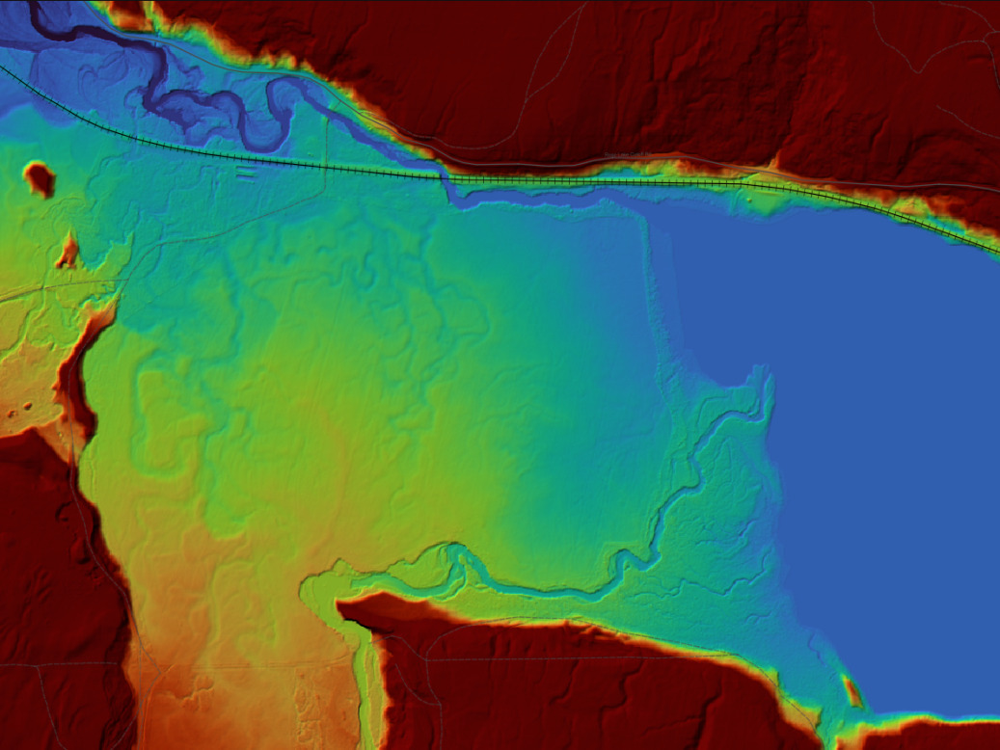
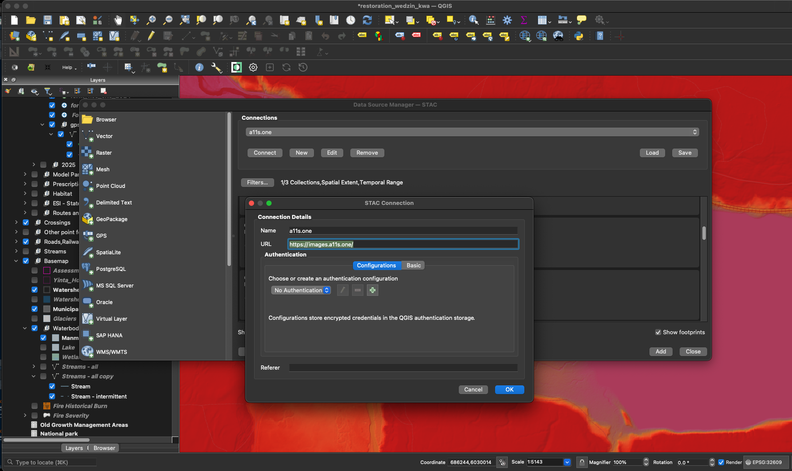
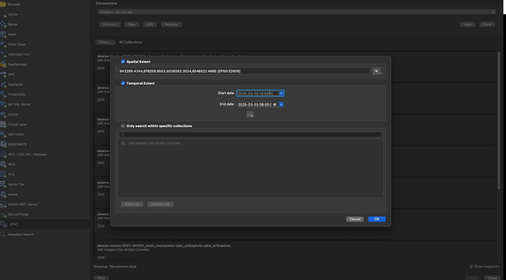

```{r setup, echo=FALSE, include = TRUE}
knitr::opts_chunk$set(echo=TRUE, message=FALSE, warning=FALSE, dpi=60, out.width = "100%")

```


```{r, echo=FALSE, include = T}
staticimports::import()
source('scripts/staticimports.R')
source('scripts/functions.R')
```


```{r build, echo= FALSE, eval = FALSE}
# we need to change the rmd_on param to FALSE to render the README.md for the github landing page
rmarkdown::render(
  "README.Rmd",
  output_format = "github_document",
  params = list(rmd_on = FALSE, update_query = FALSE)
  )

rmarkdown::render(
  "README.Rmd",
  output_format = "html_document",
  output_file = "index.html",
  params = list(rmd_on = TRUE, update_query = FALSE)
  )
```

<!-- README.md is generated from README.Rmd. Please edit that file -->


**`stac-elevation-bc`** serves British Columbia's [LidarBC](https://lidar.gov.bc.ca/) elevation data as a [SpatioTemporal Asset Catalog (STAC)](https://stacspec.org/) — **102,460 tiles** on the provincial objectstore, searchable by location and time from the [`rstac` R package](https://brazil-data-cube.github.io/rstac/), QGIS (v3.42+), or any STAC-compliant client. The endpoint is <https://images.a11s.one>.

Each item carries up to two assets from the same flight over the same footprint:

| asset | what it is |
|---|---|
| `dem` | bare-earth digital elevation model — every item has one |
| `dsm` | digital surface model, where the delivery published one — **95,888 of 102,460** |

An item's **geometry is its footprint** — the part of the tile that holds data, not the raster's extent ([#2](https://github.com/NewGraphEnvironment/stac_dem_bc/issues/2)). For tiles named on the BC Geographic System 1:2,500 grid it is the grid cell minus any no-data inside it, so a full tile's footprint is exactly its cell and neighbours meet without overlapping; for the rest it is the valid data. A search for an area a tile has no data over no longer returns that tile. The `dem` asset carries `raster:bands[0].statistics.valid_percent` (the share of the raster holding elevations) and, where the whole file was read, `file:checksum` (sha256) and `file:size`. The DSM is assumed to cover what the DEM covers; its own coverage is not measured. Every item from a LidarBC delivery carries `lidarbc:delivery` (`"092/092g/2016"`), the key [`stac-pointcloud-bc`](https://github.com/NewGraphEnvironment/stac_pointcloud_bc) items share, so a tile matches its delivery's point clouds with one filter ([#55](https://github.com/NewGraphEnvironment/stac_dem_bc/issues/55)); the `lidarbc:` fields are defined in [crate](https://github.com/NewGraphEnvironment/crate).

<br>

The catalog refreshes monthly: a scheduled [GitHub Actions workflow](.github/workflows/update.yml) detects new tiles on the objectstore and appends them incrementally, with each month's changes landing as a commit to [`data/`](data/) — a git audit trail of what was added, removed, and validated. How the automation works, its failure modes, and where the evidence lives are documented in [`scripts/`](scripts/README.md), alongside a plain-language guide to the concepts behind the pipeline (COG, STAC, pgstac, validation caching).

<br>

```{r fig, echo=FALSE, out.width="100%", fig.align="center"}

```

<br>

## Query the collection

Use [`bcdata`](https://github.com/bcgov/bcdata) to define an area of interest, then query the `stac-elevation-bc` collection for elevation tiles intersecting it. Below: all DEMs covering the Bulkley River watershed group between 2018 and 2020.

```{r api1, eval=params$update_query}

aoi <- bcdata::bcdc_query_geodata("freshwater-atlas-watershed-groups") |>
  bcdata::filter(WATERSHED_GROUP_NAME == "Bulkley River") |>
  bcdata::collect() |>
  sf::st_transform(crs = 4326)

date_start <- "2018-01-01T00:00:00Z"
date_end <- "2020-12-31T00:00:00Z"

# use rstac to query the collection
q <- rstac::stac("https://images.a11s.one/") |>
  rstac::stac_search(
    collections = "stac-elevation-bc",
    intersects = jsonlite::fromJSON(
      geojsonsf::sf_geojson(
        aoi, atomise = TRUE, simplify = FALSE
      ),
      simplifyVector = FALSE
    ) |> (\(x) x$geometry)(),
    datetime = paste0(date_start, "/", date_end)
  ) |>
  rstac::post_request()

# get details of the items
r <- q |>
  rstac::items_fetch()

# burn the results locally so we can serve it instantly on index.html builds
saveRDS(r, "data/stac_result.rds")
```


```{r}
r <- readRDS("data/stac_result.rds")

# One row per ASSET, not per item. Every item carries a bare-earth `dem`, and
# most also carry a `dsm` from the same flight -- a dem-only column hid half of
# what the collection serves.
tab <- purrr::map_dfr(r$features, function(f) {
  purrr::imap_dfr(f$assets, function(a, key) {
    tibble::tibble(
      tile     = f$id,
      date     = substr(f$properties$datetime, 1, 10),
      type     = key,
      download = glue::glue('<a href="{a$href}" target="_blank">{basename(a$href)}</a>')
    )
  })
}) |>
  dplyr::arrange(tile, type)
```

<br>

`r if (params$rmd_on == FALSE) "Please see http://www.newgraphenvironment.com/stac_dem_bc for the published table of collection links."`


```{r tab-cap, echo=FALSE, results="asis", eval=identical(params$rmd_on, TRUE)}
my_caption <- "Download links for every asset returned by the query above — one row per asset, so a paired item shows its `dem` and `dsm` together."
my_tab_caption_rmd()
```


```{r tab-uav-imagery, echo=FALSE, eval=identical(params$rmd_on, TRUE)}
tab |>
  my_dt_table(cols_freeze_left = 2, escape = FALSE)
```

<br>

Every row above is a `dem`, because the Bulkley was flown between 2000 and 2020 and
those deliveries published no surface model. Province-wide **95,888 of 102,460 items
carry a `dsm`** — the same flight over the same footprint at the same time — but the
coverage is concentrated in the 2024 deliveries, so whether you get one depends on
when your area was last flown rather than on where it is.


## QGIS Data Source Manager (v3.42+)

QGIS 3.42 added native STAC support — connect directly to the catalog and filter by the current map view. See [Lutra Consulting's STAC-in-QGIS blog post](https://www.lutraconsulting.co.uk/blogs/stac-in-qgis) for a walk-through.

QGIS draws each item's `bbox`, not its geometry. Since the bbox is the bounds of the footprint, a partly empty tile's box now shrinks to its data, but a tile whose data is a diagonal strip still draws as a rectangle.

```{r echo=FALSE, fig.cap="Connecting to https://images.a11s.one"}

```

```{r echo=FALSE, fig.cap= "Using the field of view in QGIS to filter results"}

```


## Sister collections on the same endpoint

The same `images.a11s.one` STAC API serves several complementary BC collections:

- [`stac_floodplains_bc`](https://github.com/NewGraphEnvironment/stac_floodplains_bc) — floodplain land-cover change (`stac-floodplains-bc`)
- [`stac_airphoto_bc`](https://github.com/NewGraphEnvironment/stac_airphoto_bc) — historic airphoto thumbnails, 1963–2019 (`stac-airphoto-bc`)
- [`stac_uav_bc`](https://github.com/NewGraphEnvironment/stac_uav_bc) — UAV imagery, organized by watershed (`imagery-uav-bc-prod`)


## Roadmap

The big one landed in 2026: the catalog is now **self-updating** ([#23](https://github.com/NewGraphEnvironment/stac_dem_bc/issues/23)) — the goal open since the first build — and the July catch-up grew the collection from 58k to ~98k fully-validated items. Items now also carry the **digital surface model** alongside the bare-earth DEM ([#31](https://github.com/NewGraphEnvironment/stac_dem_bc/issues/31)), paired on tile id and acquisition date, and each item's geometry is its **footprint** — the tile's grid cell minus its no-data — rather than its raster extent ([#2](https://github.com/NewGraphEnvironment/stac_dem_bc/issues/2)). Still ahead:

- **Registration from CI** — registration is a client-side upsert from this repo (the [`stacs`](https://github.com/NewGraphEnvironment/stacs) package, configured by `stacs.toml`), but it still runs from a laptop: no GitHub Actions runner can reach the STAC host today. Closing that needs a tailnet or deploy-key decision in the infrastructure repo, and it unblocks every catalogue repo at once.
- **Upstream-deletion handling** ([#28](https://github.com/NewGraphEnvironment/stac_dem_bc/issues/28)) — propagate objectstore removals to the catalog. The September run settled the open question — the deleted tiles did not reappear under new names, so they are deletions rather than a rename in flight.
- **Surface models published as point cloud only** — 1,211 DEM tiles across 11 mapsheet-years have a `dsm/` directory holding only `.laz`. Recorded as a declared coverage gap in `data/dsm_pairing_report.md`; deriving a raster from the point cloud is unscoped.
- **CHM** ([#29](https://github.com/NewGraphEnvironment/stac_dem_bc/issues/29)) — 264 canopy-height tiles are published province-wide, ~1.1% coverage of the mapsheet-years that carry them. Worth indexing for completeness; not a substitute for deriving.
- **Structured logging + performance benchmarking** ([#6](https://github.com/NewGraphEnvironment/stac_dem_bc/issues/6)) — instrument the pipeline so build performance is quantifiable across runs.
- **uv-based Python dependency management** ([#16](https://github.com/NewGraphEnvironment/stac_dem_bc/issues/16)) — the CI workflow already installs with uv; migrate the local conda environment to match.

Browse [open issues](https://github.com/NewGraphEnvironment/stac_dem_bc/issues) for the full backlog.


## License

[MIT](LICENSE).
