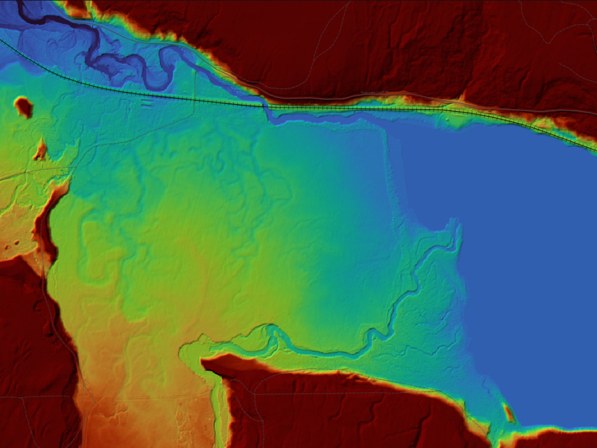
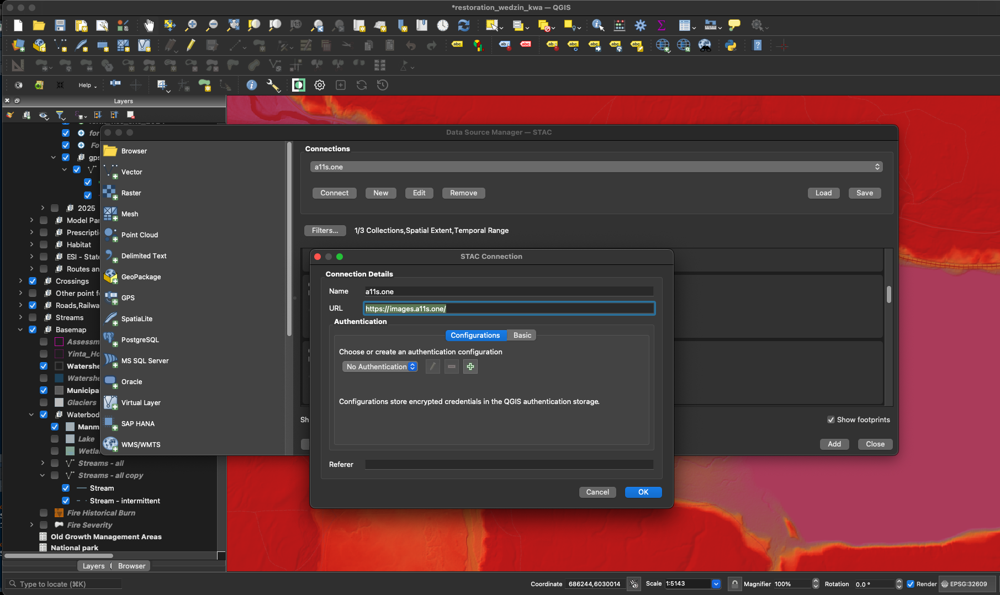
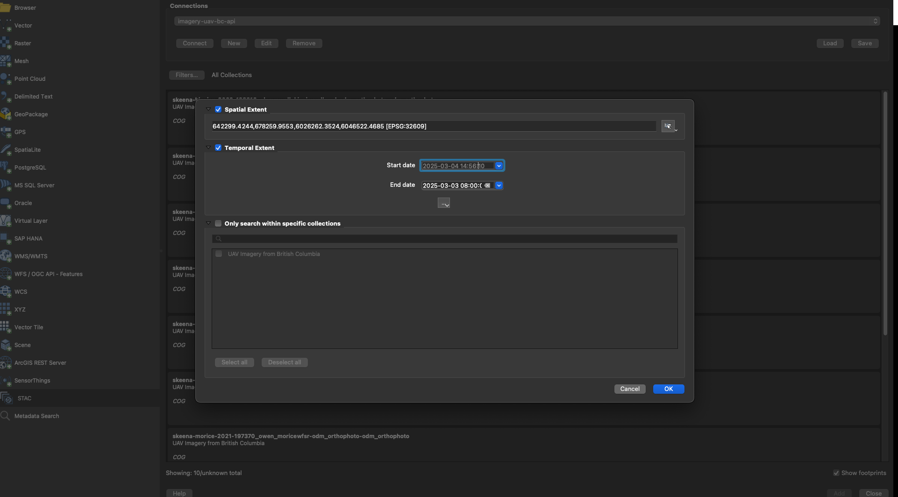

stac_dem_bc
================

<!-- README.md is generated from README.Rmd. Please edit that file -->


The goal of
[`stac_dem_bc`](https://github.com/NewGraphEnvironment/stac_dem_bc) is
to serve British Columbia’s [LidarBC](https://lidar.gov.bc.ca/) digital
elevation model collection (~58,000 GeoTIFFs hosted on the provincial
objectstore) as a [SpatioTemporal Asset Catalog
(STAC)](https://stacspec.org/), queryable by location and time via the
[`rstac` R package](https://brazil-data-cube.github.io/rstac/), QGIS
(v3.42+), or any STAC-compliant client. The API endpoint is
<https://images.a11s.one>.

<br>

The build pipeline lives under [`scripts/`](scripts/README.md) — a
six-step flow (fetch → validate-access → collection-create → item-create
→ item-validate → s3-sync) that turns the raw provincial GeoTIFF URLs
into a searchable pgstac catalog. See the [scripts
README](scripts/README.md) for the pipeline walkthrough; key concepts
(COG, STAC, pgstac, date extraction from filenames, validation caching
for incremental rebuilds) are explained there in plain language.

<br>



<br>

## Query the collection

Use [`bcdata`](https://github.com/bcgov/bcdata) to define an area of
interest, then query the `stac-dem-bc` collection for DEM tiles
intersecting it. Below: all DEMs covering the Bulkley River watershed
group between 2018 and 2020.

``` r
aoi <- bcdata::bcdc_query_geodata("freshwater-atlas-watershed-groups") |>
  bcdata::filter(WATERSHED_GROUP_NAME == "Bulkley River") |>
  bcdata::collect() |>
  sf::st_transform(crs = 4326)

date_start <- "2018-01-01T00:00:00Z"
date_end <- "2020-12-31T00:00:00Z"

# use rstac to query the collection
q <- rstac::stac("https://images.a11s.one/") |>
  rstac::stac_search(
    collections = "stac-dem-bc",
    intersects = jsonlite::fromJSON(
      geojsonsf::sf_geojson(
        aoi, atomise = TRUE, simplify = FALSE
      ),
      simplifyVector = FALSE
    ) |> (\(x) x$geometry)(),
    datetime = paste0(date_start, "/", date_end)
  ) |>
  rstac::post_request()

# get details of the items
r <- q |>
  rstac::items_fetch()

# burn the results locally so we can serve it instantly on index.html builds
saveRDS(r, "data/stac_result.rds")
```

``` r
r <- readRDS("data/stac_result.rds")
# build the table to display the info
tab <- tibble::tibble(
  url_download = purrr::map_chr(r$features, ~ purrr::pluck(.x, "assets", "image", "href"))
)
```

<br>

Please see <http://www.newgraphenvironment.com/stac_dem_bc> for the
published table of collection links.

## QGIS Data Source Manager (v3.42+)

QGIS 3.42 added native STAC support — connect directly to the catalog
and filter by the current map view. See [Lutra Consulting’s STAC-in-QGIS
blog post](https://www.lutraconsulting.co.uk/blogs/stac-in-qgis) for a
walk-through.

<div class="figure">


<p class="caption">

Connecting to <https://images.a11s.one>
</p>

</div>

<div class="figure">


<p class="caption">

Using the field of view in QGIS to filter results
</p>

</div>

## Sister collections on the same endpoint

The same `images.a11s.one` STAC API serves several complementary BC
collections:

- [`stac_uav_bc`](https://github.com/NewGraphEnvironment/stac_uav_bc) —
  UAV imagery, organized by watershed
- [`stac_airphoto_bc`](https://github.com/NewGraphEnvironment/stac_airphoto_bc)
  — historic airphoto thumbnails (1963–2019)

## Roadmap

- **uv-based Python dependency management**
  ([\#16](https://github.com/NewGraphEnvironment/stac_dem_bc/issues/16))
  — migrate from conda to uv for faster, more reproducible Python
  environments.
- **Structured logging + performance benchmarking**
  ([\#6](https://github.com/NewGraphEnvironment/stac_dem_bc/issues/6)) —
  instrument the pipeline so build performance is quantifiable across
  runs.
- **True footprint geometry**
  ([\#2](https://github.com/NewGraphEnvironment/stac_dem_bc/issues/2)) —
  recalculate per-item footprints to exclude no-data pixels rather than
  using bounding boxes; gives accurate spatial-overlap queries.
- **Validation-failure triage**
  ([\#11](https://github.com/NewGraphEnvironment/stac_dem_bc/issues/11))
  — STACError on specific item JSONs; underlying root cause + automated
  retry.

Browse [open
issues](https://github.com/NewGraphEnvironment/stac_dem_bc/issues) for
the full backlog.

## License

[MIT](LICENSE).
